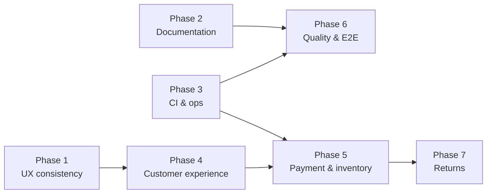

# Post-Release Roadmap — July 2026

Sequential implementation plan for hardening Zova Sport after Phase 7 (release-ready MVP). This folder supersedes ad-hoc backlog items identified in the July 2026 project review.

**Baseline:** Phases 0–7 in [README.md](../../README.md) are complete. This roadmap covers production polish, UX consistency, documentation accuracy, and post-purchase capabilities.

---

## How to use this roadmap

1. Work phases **in order** unless a dependency note says otherwise.
2. Mark tasks complete by changing `- [ ]` → `- [x]` in the phase file.
3. When a phase is fully checked, update the **Status** column in the table below.
4. Run each phase's **Verification** section before moving on.
5. Link PRs to phase files in commit messages when practical (e.g. `feat(settings): storefront security page [phase-060760/01]`).

### Status values

| Value | Meaning |
|-------|---------|
| `Not started` | No work begun |
| `In progress` | At least one task checked |
| `Done` | All tasks checked + verification passed |
| `Deferred` | Explicitly postponed (add reason in phase file) |

---

## Phase index

| # | Phase | Priority | Est. effort | Status | Doc |
|---|-------|----------|-------------|--------|-----|
| 1 | Storefront UX consistency | P0 | 3–5 days | Done | [01-ux-storefront-settings.md](./01-ux-storefront-settings.md) |
| 2 | Documentation sync | P0 | 1–2 days | Done | [02-documentation-sync.md](./02-documentation-sync.md) |
| 3 | CI/CD & ops hardening | P0 | 2–3 days | Done | [03-ci-ops-hardening.md](./03-ci-ops-hardening.md) |
| 4 | Customer experience enhancements | P1 | 5–7 days | Done | [04-customer-experience.md](./04-customer-experience.md) |
| 5 | Payment & inventory ops | P1 | 3–4 days | Done | [05-payment-inventory-ops.md](./05-payment-inventory-ops.md) |
| 6 | Quality, E2E & monitoring | P2 | 4–6 days | Done | [06-quality-e2e-monitoring.md](./06-quality-e2e-monitoring.md) |
| 7 | Returns & extended ops | P2/P3 | 5–8 days | Done | [07-returns-extended-ops.md](./07-returns-extended-ops.md) |

**Total estimated calendar time:** 4–6 weeks (one developer, sequential). Phases 2 and 3 can overlap with Phase 1 if staffed.

---

## Dependency graph



| Phase | Depends on | Can run in parallel with |
|-------|------------|--------------------------|
| 1 | — | 2, 3 |
| 2 | — | 1, 3 |
| 3 | — | 1, 2 |
| 4 | 1 (settings nav shell) | — |
| 5 | 3 (queue mail), 4 (addresses optional) | — |
| 6 | 2, 3 | 4 (partial) |
| 7 | 5 | — |

---

## Sprint suggestion (4 weeks)

### Week 1 — Ship-ready polish (P0)

| Days | Focus |
|------|-------|
| Mon–Wed | Phase 1: storefront settings (security, appearance, nav) |
| Thu | Phase 2: documentation sync |
| Fri | Phase 3 start: CI pipeline + queued mail |

### Week 2 — Production confidence (P0 + P1 start)

| Days | Focus |
|------|-------|
| Mon–Tue | Phase 3 finish: deploy checklist, scheduler validation |
| Wed–Fri | Phase 4 start: server wishlist + saved addresses |

### Week 3 — Customer & payment (P1)

| Days | Focus |
|------|-------|
| Mon–Tue | Phase 4 finish: guest order lookup, newsletter admin |
| Wed–Fri | Phase 5: Stripe refunds, low-stock alerts |

### Week 4 — Quality & optional returns (P2)

| Days | Focus |
|------|-------|
| Mon–Wed | Phase 6: E2E smoke, test gaps, Sentry |
| Thu–Fri | Phase 7 start (if required for launch) or defer |

---

## Known gaps at roadmap start (July 2026)

These are the problems this roadmap addresses. Do not re-open completed Phase 0–7 items unless a regression is found.

| Area | Current state | Target phase |
|------|---------------|--------------|
| Customer settings UX | Profile uses storefront layout; security/appearance use legacy `AppLayout` | 1 |
| Auth pages | New `auth-storefront-layout` for login/register (in progress) | 1 |
| `docs/BUSINESS_LOGIC.md` | Describes MVP cart + COD only | 2 |
| `docs/DB_SCHEMA.md` | "Not implemented" for post-MVP tables | 2 |
| `docs/PERMISSIONS.md` | References Supabase RLS | 2 |
| CI pipeline | Runs `php artisan test` only | 3 |
| Order emails | Synchronous `Mail::send()` | 3 |
| Wishlist | Client-side localStorage only | 4 |
| Saved addresses | Re-entered every checkout | 4 |
| Guest order recovery | Session-only `guest_order_access` | 4 |
| Newsletter admin | DB table exists, no admin UI | 4 |
| Stripe cancel/refund | No automatic refund on paid cancel | 5 |
| Low-stock alerts | None | 5 |
| E2E tests | None | 6 |
| Test gaps | Size guides, brands, homepage CMS, wishlist | 6 |
| Returns / RMA | Online return workflow with admin review | 7 (done) |

---

## Global verification (after all P0 phases)

```bash
composer ci:check
php artisan vsport:deploy-check --strict
npm run build
```

---

## Progress log

| Date | Phase | Notes |
|------|-------|-------|
| 2026-07-06 | — | Roadmap created from post-release review |
| 2026-07-07 | 6 | Playwright E2E, Sentry, feature tests (387 Pest passing) |
| 2026-07-06 | 1 | Done. Storefront security/appearance settings pages shipped with role-based routing, extended settings nav, i18n, tests, and in-browser QA. See [phase file](./01-ux-storefront-settings.md) progress log. |
| 2026-07-06 | 2 | Done. BUSINESS_LOGIC.md, DB_SCHEMA.md, PERMISSIONS.md rewritten against actual migrations/services; DEPLOYMENT.md minor updates. Discovered and documented that the catalog moved from colorway-based to a generic option-based model. See [phase file](./02-documentation-sync.md) progress log. |
| 2026-07-06 | 3 | Done. CI now runs `composer ci:check` (will show red until pre-existing lint/type debt is cleaned up separately, per user decision). Order mail queued, deploy-check warns on sync queue, `.env.example` + DEPLOYMENT.md updated. **Fixed a real bug**: the scheduler (`bootstrap/app.php`) had a wrong type-hint import that made `schedule:run`/`schedule:list` fatal-error, so `carts:release-expired`/`analytics:sync` never actually ran via cron before this fix. See [phase file](./03-ci-ops-hardening.md) progress log. |
| 2026-07-07 | 4 | Done. Server-side wishlist (with client-side merge-on-login), saved shipping addresses, guest order lookup, newsletter admin export — all shipped with tests + browser verification. **Fixed a real bug**: `bootstrap/app.php`'s API exception handler returned `500` instead of `401`/`403` for auth failures on any `api/*` route (never triggered before since no prior `api/*` route required auth). **Found but did not fix** a pre-existing Dialog rendering bug affecting all modals app-wide (including the already-shipped delete-account dialog) — flagged for follow-up. See [phase file](./04-customer-experience.md) progress log. |
| 2026-07-07 | 5 | Done. Stripe auto-refund on cancelling a confirmed/shipping/delivered order (COD and `pending` cancels never attempt one), admin retry UI for failed refunds, daily low-stock alert email with per-SKU dedup, refund status added to order CSV export. Verified the refund failure path in a real browser (invalid Stripe key) — degrades gracefully, no crash. Also caught and fixed BUSINESS_LOGIC.md/DB_SCHEMA.md drift left over from Phase 4 (wishlist/address tables were never documented; §13/§14 still called Phase 4 features "not yet implemented"). See [phase file](./05-payment-inventory-ops.md) progress log. |
| 2026-07-07 | 7 | Done. RMA + extended ops: tracking fields, customer track page, bulk order status, CSV export. 400 Pest tests passing. See [phase file](./07-returns-extended-ops.md). |

_Add a row when a phase completes or when scope changes._
